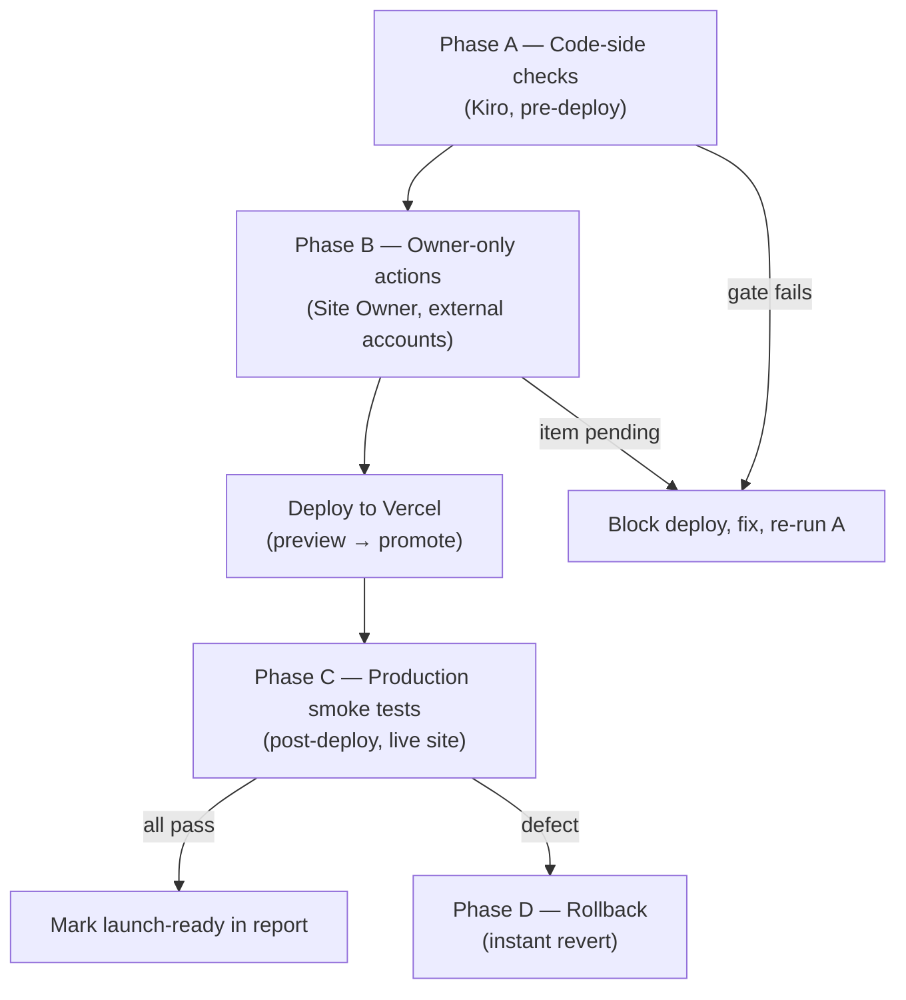

# Design Document

## Overview

This design describes **how ShubhMarg is verified and deployed to production**, not how a
product feature is built. It is the technical companion to
`requirements.md` (18 launch requirements) and defines, for each requirement, the concrete
mechanism used to prove it holds: an automated/inspectable check Kiro can run against the
codebase, a privileged owner action against an external account, or a post-deploy smoke
test against the live site.

The subject system is the existing ShubhMarg codebase: Next.js 16 (Turbopack) + React 19,
Supabase (`@supabase/ssr`) for Postgres/Auth/RLS, deployed to **shubhmarg.com** on Vercel.
The build already passes clean (~70 routes). No product features are added here. The only
code-side changes this design introduces are two small, real gaps:

1. `.env.example` is missing three variables the code actually reads — `GEMINI_API_KEY`,
   `GEMINI_MODEL` (`src/lib/gemini.ts`) and `NEXT_PUBLIC_META_PIXEL_ID`
   (`src/components/.../MetaPixel.tsx`). They must be added so the launch operator knows to
   set them (Gemini powers AI report generation; Meta Pixel powers launch analytics).
2. The Telegram webhook secret check has a **dev fallback that skips verification when the
   secret is empty** (`verifyTelegramSecret` in `src/lib/telegram.ts` returns `true` when
   `TELEGRAM_WEBHOOK_SECRET` is unset). Launch verification must confirm the secret is
   non-empty in production so the check is actually enforced.

Everything else in this document is verification procedure and deployment process built on
top of what already exists in the repo.

### What this design is / is not

- **Is:** a launch-readiness pipeline, a requirement→check verification matrix, an env-var
  inventory, a DB/RLS plan, per-flow smoke tests, a Vercel deploy sequence, a rollback plan,
  and an owner action checklist.
- **Is not:** new UI, new API routes, schema changes, or refactors. If a verification step
  fails, the fix is scoped narrowly and tracked, not designed here.

## Architecture

### Launch Readiness Pipeline

The process runs in four phases. Phases A→C are strictly ordered (do not deploy before A
passes; do not smoke-test before B completes). Phase D is the always-available escape hatch.



**Phase A — Code-side automated / inspectable checks (Kiro can do now).**
Run against the repo with no production access: production build + type-check, env-var
audit by grepping the code for `process.env.*` reads, file-existence checks for special
files/legal pages/PWA assets, static inspection of `proxy.ts`, webhook secret handling,
`sitemap.ts`/`robots.ts`/metadata, and design-system guards (Lenis `syncTouch`, WebGL
off-screen pause, mobile blur cap).

**Phase B — Owner-only actions (Site Owner, external accounts).**
Actions requiring production credentials or billing that Kiro cannot perform: enable
Supabase Phone Auth + fund SMS billing; set Vercel env vars/secrets; run the migration set
against production Supabase; register the Telegram `setWebhook` and the UPI mail/webhook;
point DNS for shubhmarg.com; fund the UPI payee account. Each is an `Owner_Action_Item`,
each is approval-required, each stays *pending* until the owner confirms.

**Phase C — Production smoke tests (after deploy).**
Executed against the live deployment: OTP login, wallet top-up + Telegram approve/reject,
UPI order + webhook confirm, admin fail-closed, SEO/OG/robots/sitemap fetch, PWA/manifest
fetch, 404/error/empty/loading, legal pages + footer links, theme/festival/i18n,
analytics page-view.

**Phase D — Rollback.**
Vercel instant rollback to the previous good deployment; DB migrations are forward-only and
handled separately (see Rollback Plan).

### Responsibility split

| Actor | Scope |
|-------|-------|
| **Kiro / Launch Operator** | Phase A checks, Phase C scripted/observed smoke tests, recording results in the report |
| **Site Owner** | Every Phase B `Owner_Action_Item` (approval-required); iOS device spot-check |

## Verification Matrix

Each of the 18 requirements maps to a check method and whether it needs owner action.
Method legend: **BUILD** = build/type-check; **GREP/FILE** = static code/file inspection;
**OWNER** = privileged external action; **SMOKE** = post-deploy live test.

| Req | Topic | How verified | Method | Owner action? |
|-----|-------|--------------|--------|---------------|
| 1 | Build & type-check | `npm run build` exits 0; type-check clean; record result | BUILD | No |
| 2 | Prod env vars present | Grep code for every `process.env.*`; confirm each set in Vercel | GREP/FILE + OWNER | Yes (set in Vercel) |
| 3 | Migrations + RLS | Confirm `database/migrations/` order; owner applies to prod; verify tables + RLS | FILE + OWNER + SMOKE | Yes (run migrations) |
| 4 | Phone Auth / OTP | Owner enables Phone Auth + SMS billing; live OTP request→verify | OWNER + SMOKE | Yes (enable + fund SMS) |
| 5 | Wallet + Telegram | Owner registers `setWebhook`; live top-up → approve/reject | OWNER + SMOKE | Yes (register webhook) |
| 6 | UPI payment | Owner registers UPI webhook + VPA; live order → webhook confirm | OWNER + SMOKE | Yes (webhook + VPA) |
| 7 | Webhook secrets | Confirm secrets set; unsigned request rejected, no state change | GREP/FILE + SMOKE | Yes (set secrets) |
| 8 | Admin fail-closed | Inspect `proxy.ts`; live request without creds → challenge | GREP/FILE + SMOKE | No (verify) |
| 9 | SEO / OG / robots / sitemap | Inspect `layout.tsx`, `sitemap.ts`, `robots.ts`; fetch live | GREP/FILE + SMOKE | No |
| 10 | Favicon / manifest / PWA | Confirm `favicon.ico`, `public/manifest.json`, icons; fetch live | FILE + SMOKE | No |
| 11 | Mobile / iOS perf | Verify `syncTouch:false`, WebGL off-screen pause, blur cap; owner device spot-check | GREP/FILE + OWNER | Yes (iOS spot-check) |
| 12 | Accessibility basics | Inspect contrast tokens, focus states, reduced-motion guard | GREP/FILE + SMOKE | No |
| 13 | Analytics | Confirm `NEXT_PUBLIC_META_PIXEL_ID` wired + set; live page-view | GREP/FILE + OWNER + SMOKE | Yes (set pixel id) |
| 14 | Error/empty/loading/404 | Confirm `error.tsx`/`loading.tsx`/`not-found.tsx`; live checks | FILE + SMOKE | No |
| 15 | Legal pages + links | Confirm legal route folders; footer links; live fetch | FILE + SMOKE | No |
| 16 | Rollback plan | Confirm documented (this design) | FILE | No |
| 17 | Owner approval gate | Maintain `Owner_Action_Item` list; block until all confirmed | PROCESS + OWNER | Yes (all items) |
| 18 | Theme / festival / i18n | Verify no bg-flash, Janmashtami greeting, 8-language key coverage | GREP/FILE + SMOKE | No |

## Components and Interfaces

The "components" here are the verification sections that make up the pipeline. Each has an
input (what it inspects), a check (the condition), and a pass/fail output recorded in the
`Launch_Readiness_Report`.

### 1. Build & Type Gate (Req 1)
- **Input:** repo root; `package.json` scripts (`build` = `next build`, `lint` = `eslint`).
- **Check:** `npm run build` completes with exit code 0 and zero type errors (Next 16 type-checks during build). `npm run lint` clean.
- **Fail behavior:** any error blocks deploy; record the failing output in the report.

### 2. Env Var Inventory & Sync (Req 2, 7, 13)
Source of truth is the code, discovered by grepping `process.env.` across `src/`. The
inventory below separates client-exposed (`NEXT_PUBLIC_*`, baked into the bundle) from
server-only secrets (never sent to the client).

**Server-only secrets (set in Vercel, never `NEXT_PUBLIC`):**

| Var | Read by | Purpose |
|-----|---------|---------|
| `SUPABASE_SERVICE_ROLE_KEY` | `src/lib/supabase` | Privileged server DB access |
| `ADMIN_USERNAME` / `ADMIN_PASSWORD` | `src/proxy.ts` | Admin Basic Auth (fail-closed) |
| `ASTROLOGY_API_ACCESS_TOKEN` | calendar integration | AstrologyAPI calls |
| `UPI_WEBHOOK_SECRET` | `src/app/api/upi-webhook/route.ts` | UPI webhook auth (constant-time compare) |
| `TELEGRAM_BOT_TOKEN` / `TELEGRAM_CHAT_ID` | `src/lib/telegram.ts` | Bot send + target chat |
| `TELEGRAM_WEBHOOK_SECRET` | `src/lib/telegram.ts` | Telegram webhook auth (**must be non-empty in prod**) |
| `GEMINI_API_KEY` ⚠️ *(missing from `.env.example`)* | `src/lib/gemini.ts` | AI guidance report generation |
| `GEMINI_MODEL` ⚠️ *(missing from `.env.example`)* | `src/lib/gemini.ts` | Gemini model id (default `gemini-3.6-flash`) |

**Client-exposed (`NEXT_PUBLIC_*`, safe to ship in bundle):**

| Var | Read by | Purpose |
|-----|---------|---------|
| `NEXT_PUBLIC_SUPABASE_URL` | client + `src/proxy.ts` | Supabase project URL |
| `NEXT_PUBLIC_SUPABASE_ANON_KEY` | client + `src/proxy.ts` | Supabase anon key |
| `NEXT_PUBLIC_UPI_VPA` | UPI QR component | Payee VPA in QR |
| `NEXT_PUBLIC_UPI_PAYEE_NAME` | UPI QR component | Payee name in QR |
| `NEXT_PUBLIC_META_PIXEL_ID` ⚠️ *(missing from `.env.example`)* | `MetaPixel.tsx` | Meta Pixel analytics id |

- **Code change (this design):** add the three ⚠️ vars to `.env.example` with placeholder
  values and comments, so the operator has a complete template. This is the only file the
  design edits; it does not change runtime behavior.
- **Check:** every var above is set (non-empty) in the Vercel Production environment. Report
  by **name only** — never print secret values (Req 2.3).
- **Owner action:** setting the values in Vercel is `Owner_Action_Item` (Req 2.4).

### 3. DB Migration & RLS Plan (Req 3)
- **Migration set** (`database/migrations/`, applied in filename order):
  `01_guidance_requests` → `02_add_email_to_guidance_requests` → `02_add_payment_fields` →
  `03_add_privacy_consent` → `04_add_delivered_status` → `05_support_requests` →
  `06_calendar_events` → `07_calendar_occurrences` → `08_calendar_panchang` →
  `09_calendar_normalization` → `10_payment_amount_decimal` → `11_user_profiles` →
  `12_wallets`. Files `11` and `12` create `user_profiles`, `wallets`,
  `wallet_transactions` with RLS policies and auto-create triggers.
- **Check (post-apply, via Supabase SQL editor / smoke):** tables `guidance_requests`,
  `user_profiles`, `wallets`, `wallet_transactions` exist; RLS is **enabled** on every
  user-owned table and each has an owner-scoped policy (`auth.uid() = user_id`).
- **Owner action:** running the migration set against production Supabase is an
  `Owner_Action_Item` (Req 3.5). Migrations are **forward-only** (see Rollback).

### 4. Auth / OTP Verification (Req 4)
- **Owner action:** enable Phone provider in Supabase Auth, connect an SMS provider, and
  fund SMS billing (`Owner_Action_Item`; OTP will not send until funded).
- **Smoke:** on the live site, request OTP for a real phone → SMS arrives; enter correct
  code → authenticated session established; enter wrong/expired code → rejected with error.

### 5. Wallet + Telegram e2e Test (Req 5, 7)
- **Owner action:** register the webhook once (conceptual):
  `https://api.telegram.org/bot<TELEGRAM_BOT_TOKEN>/setWebhook?url=https://shubhmarg.com/api/telegram-webhook&secret_token=<TELEGRAM_WEBHOOK_SECRET>`.
  Telegram then sends the secret in the `x-telegram-bot-api-secret-token` header on each
  call, which `verifyTelegramSecret` checks.
- **Smoke steps:**
  1. Authenticated user submits a top-up → a `pending` `wallet_transactions` row is created
     and a Telegram alert with Approve/Reject buttons reaches the owner chat.
  2. Owner taps **Approve** → wallet `balance_paise` credited (optimistic-lock update), tx
     marked `completed`; double-tap is idempotent (guard on `status='pending'`).
  3. Owner taps **Reject** → tx marked `failed`, balance unchanged.
  4. Send a POST to `/api/telegram-webhook` **without** the secret header → `401`, no wallet
     change.
- **Security gate:** confirm `TELEGRAM_WEBHOOK_SECRET` is non-empty in production. If empty,
  `verifyTelegramSecret` returns `true` (dev skip) and the endpoint is unprotected — this
  must be treated as a launch blocker (Req 7.3).

### 6. UPI e2e Test (Req 6, 7)
- **Owner action:** configure production `NEXT_PUBLIC_UPI_VPA` / `NEXT_PUBLIC_UPI_PAYEE_NAME`,
  fund the payee account, and wire the UPI mail/webhook source (the Gmail script or provider)
  to POST to `/api/upi-webhook` with the `x-webhook-secret` header set to `UPI_WEBHOOK_SECRET`.
- **Smoke steps:**
  1. Start a guidance order → UPI QR renders containing the production VPA and payee name.
  2. POST a valid confirmation to `/api/upi-webhook` with the correct secret and a matching
     amount/UTR → matched order flips to `paid`, report generation is triggered.
  3. Repeat the same UTR → `duplicate`, no double-confirm (idempotency guard `neq status paid`).
  4. POST without / with a wrong secret → `401`, no order marked paid. The UPI check is
     **fail-closed** already (`secretOk` returns false when either side is empty).

### 7. Webhook Registration Steps (Req 5, 6, 7)
- **Telegram:** `setWebhook` with `secret_token` as above (one-time).
- **UPI:** point the mail/webhook source at `https://shubhmarg.com/api/upi-webhook` and set
  its shared header `x-webhook-secret = UPI_WEBHOOK_SECRET`.
- **Property (both):** an unsigned/mis-signed request produces **no state change** (see
  Correctness Properties).

### 8. Admin Fail-Closed Test (Req 8)
- **Inspect:** `src/proxy.ts` gates `/admin` routes with Basic Auth and, in production,
  returns `500` (denies all) when `ADMIN_USERNAME`/`ADMIN_PASSWORD` are missing (fail-closed).
  Supabase session refresh is guarded by presence of the `NEXT_PUBLIC_SUPABASE_*` vars.
- **Smoke:** request an `/admin` route with no creds → auth challenge/denied; with correct
  creds → access granted.

### 9. SEO / robots / sitemap / OG Verification (Req 9)
- **Inspect:** `src/app/layout.tsx` has full metadata + OpenGraph + twitter and
  `metadataBase = https://shubhmarg.com`; `src/app/sitemap.ts` (baseUrl hardcoded
  `https://shubhmarg.com`, 11 routes); `src/app/robots.ts` (allow `/`, disallow `/admin/`
  and `/payment/`, sitemap `https://shubhmarg.com/sitemap.xml`).
- **Smoke:** fetch `/sitemap.xml` and `/robots.txt` on the live domain; confirm robots does
  **not** globally disallow crawling (Req 9.4); verify OG image URL resolves.

### 10. PWA / Manifest Check (Req 10)
- **Inspect:** `public/manifest.json` exists, `favicon.ico` exists, and every icon the
  manifest references exists in `public/`.
- **Smoke:** fetch `/manifest.json` and each referenced icon on the live domain → all 200.

### 11. Mobile / iOS Spot-Check (Req 11)
- **Inspect (design-system guards):** Lenis `syncTouch: false`; every WebGL/Three.js canvas
  pauses off-screen (`IntersectionObserver` → `frameloop="never"`); ambient blur capped on
  <768px per the globals.css mobile guard.
- **Owner action:** iOS device spot-check (`Owner_Action_Item`); any scroll/render defect
  fails the gate.

### 12. Accessibility Checks (Req 12)
- **Inspect:** dark-on-light contrast tokens (no faint light text on light bg); interactive
  elements expose a visible focus state; reduced-motion guard suppresses infinite loops.

### 13. Analytics Check (Req 13)
- **Inspect:** `MetaPixel.tsx` reads `NEXT_PUBLIC_META_PIXEL_ID`.
- **Owner action:** set the pixel id in Vercel (if missing, gate is *incomplete* and recorded
  as `Owner_Action_Item`, Req 13.3).
- **Smoke:** load a live page and confirm a page-view event fires to Meta Pixel.

### 14. Error / Empty / Loading + 404 Check (Req 14)
- **Inspect:** `src/app/error.tsx`, `src/app/loading.tsx`, `src/app/not-found.tsx`,
  `src/app/template.tsx` all exist.
- **Smoke:** hit an unknown route → branded 404; observe skeleton/loading and empty-state
  prompts on data sections; force a failing request → error state (not blank).

### 15. Legal Pages + Footer Link Check (Req 15)
- **Inspect:** route folders `src/app/privacy-policy`, `src/app/terms`, `src/app/refunds`,
  `src/app/disclaimer` exist; footer links to each.
- **Smoke:** fetch each legal path on the live domain → 200; confirm footer links resolve.

### 16. Theme / Festival / i18n Check (Req 18)
- **Smoke/inspect:** page renders the bright temple aesthetic with no body background flash
  on load; Janmashtami greeting shows when the date matches; the `useT()` system resolves
  strings for all 8 languages with no missing keys.

## Data Models

This is a process design; the only structured artifacts are the report and the owner
checklist.

**Launch_Readiness_Report** (per-requirement outcome; secrets excluded):
```
{
  requirementId: 1..18,
  title: string,
  method: "BUILD" | "GREP/FILE" | "OWNER" | "SMOKE" | "PROCESS",
  status: "pass" | "fail" | "incomplete" | "pending",
  evidence: string,          // e.g. "build exit 0", "GET /robots.txt 200, allow /"
  ownerActionRequired: boolean,
  notes: string
}
```

**Owner_Action_Item** (Req 17; each approval-required):
```
{
  id: string,
  description: string,       // e.g. "Set Vercel prod env vars"
  approvalRequired: true,
  status: "pending" | "confirmed",
  blocksGoLive: true
}
```

Go-live is allowed only when every report entry is `pass`/`confirmed` and no
`Owner_Action_Item` remains `pending` (Req 17.3–17.4).

## Correctness Properties

*A property is a characteristic or behavior that should hold true across all valid executions
of a system — a formal statement about what the system should do, serving as the bridge
between human-readable specifications and machine-verifiable correctness guarantees.*

Most of this spec is process verification, IaC-like configuration, and post-deploy smoke
testing, which are validated by build/file/HTTP checks rather than property-based tests.
The one area with genuine input-varying, security-critical logic worth stating as universal
properties is **webhook authentication** — the endpoints must never mutate state on an
unauthenticated request, for any request body.

### Property 1: Unsigned webhook requests cause no state change
*For any* request body sent to `/api/telegram-webhook` or `/api/upi-webhook` **without** the
matching shared secret, the endpoint SHALL reject the request (auth failure) and SHALL leave
all wallet balances, `wallet_transactions` rows, and `guidance_requests` payment states
unchanged.

**Validates: Requirements 5.4, 6.3, 7.2**

### Property 2: Webhook confirmation is idempotent
*For any* already-processed payment or approval event replayed to its webhook (same UTR to
`/api/upi-webhook`, or same `approve:<txId>` to `/api/telegram-webhook`), the endpoint SHALL
NOT apply the effect a second time (no double-credit, no double-mark-paid).

**Validates: Requirements 5.2, 6.2**

*(These properties describe existing behavior — the UPI `secretOk` constant-time compare and
`neq payment_status paid` guard, and the Telegram `status='pending'` guard. They are stated
so the smoke tests in Sections 5–7 assert them, and are not a mandate to add a PBT suite for
the launch process itself.)*

## Error Handling

### Risks

- **OTP will not send until the SMS provider is funded** (Req 4). Until Phase B billing is
  done, login is expected to fail — this is an owner blocker, not a code bug.
- **Empty webhook secret = unprotected endpoint.** `verifyTelegramSecret` returns `true` when
  `TELEGRAM_WEBHOOK_SECRET` is empty (dev fallback). In production this must be non-empty or
  `/api/telegram-webhook` accepts forged approvals. Treated as a launch blocker (Req 7.3).
  The UPI endpoint is already fail-closed (`secretOk` false when either secret side is empty).
- **Missing `GEMINI_API_KEY`** → report generation degrades (the client warns and proceeds
  without a key). Set it in Vercel before launch so paid orders produce reports.
- **Missing `NEXT_PUBLIC_META_PIXEL_ID`** → analytics gate is *incomplete* (Req 13.3), not a
  hard blocker, but should be set for launch measurement.
- **Migrations are forward-only.** A bad migration cannot be undone by redeploying code (see
  Rollback).
- **DNS propagation** for shubhmarg.com can lag; verify the domain resolves to Vercel before
  running Phase C smoke tests, and keep the `*.vercel.app` URL for early testing.
- **Secrets in the report:** always report env vars by name only; never echo values.

## Deployment Sequence (Vercel)

1. **Connect repo** to a Vercel project; framework preset Next.js. Confirm `build` =
   `next build` and the Node/Next 16 (Turbopack) build runs.
2. **Set env vars** in the Vercel **Production** (and Preview) environment — the full
   inventory in Section 2, including the three newly documented vars. (Owner action.)
3. **Apply migrations** to the production Supabase project in filename order; verify tables +
   RLS. (Owner action.)
4. **Deploy a Preview** build; run a reduced smoke pass on the preview URL (build health,
   SEO/manifest fetch, admin challenge, webhook 401-without-secret).
5. **Enable Phone Auth + fund SMS**, **register Telegram `setWebhook`** and the **UPI
   webhook/VPA**, **fund the UPI payee**. (Owner actions.)
6. **Promote to Production** in Vercel once Phase A passes and Phase B items are confirmed.
7. **Point DNS** for shubhmarg.com to Vercel; wait for resolution + TLS. (Owner action.)
8. **Run Phase C smoke tests** against `https://shubhmarg.com`; record results; mark
   launch-ready only when all pass.

## Rollback Plan (Req 16)

- **Last known-good:** the previous successful Production deployment in the Vercel
  Deployments list.
- **Instant revert:** in Vercel, promote the previous deployment (Instant Rollback) to
  restore the prior code build immediately — no rebuild required.
- **Database (forward-only) handling:** migrations are not reverted by rolling back code.
  If a migration caused the defect, restore from the most recent Supabase backup / point-in-
  time recovery, or apply a corrective forward migration. Never assume a code rollback undoes
  a schema change.
- **Post-rollback:** re-run the relevant Phase C smoke tests to confirm the restored state is
  healthy, and record the incident + cause in the report.

## Testing Strategy

Property-based testing does not apply to this launch-process spec (it is verification +
deploy orchestration over IaC-like config, plus HTTP smoke tests). Coverage is:

**Pre-deploy (Phase A, local/CI):**
- Build + type-check: `npm run build` exits 0, zero type errors; `npm run lint` clean.
- Env audit: grep `process.env.` across `src/` and reconcile against the Vercel env set and
  `.env.example` (which now lists all vars including the three added ones).
- File-existence checks: special files, legal route folders, `manifest.json`, favicon, icons.
- Static security inspection: `proxy.ts` fail-closed; `secretOk`/`verifyTelegramSecret`
  behavior; robots does not globally disallow.

**Post-deploy (Phase C, live production smoke, per flow):**
- Auth/OTP: request → receive SMS → verify correct and incorrect codes.
- Wallet+Telegram: top-up → approve (credit) / reject (no change); unsigned webhook → 401,
  no change (Property 1); double-tap approve → no double-credit (Property 2).
- UPI: order → QR with prod VPA; valid webhook → paid; duplicate UTR → no re-confirm
  (Property 2); unsigned/wrong secret → 401, no order paid (Property 1).
- Admin: no-creds → challenge; correct creds → access.
- SEO/PWA: fetch `/robots.txt`, `/sitemap.xml`, `/manifest.json`, icons, OG image → healthy.
- UX: unknown route → branded 404; loading/empty/error states render.
- Legal: each legal path → 200; footer links resolve.
- Theme/i18n: no bg-flash; Janmashtami greeting on date; 8-language keys resolve.
- Analytics: page load fires Meta Pixel page-view (when pixel id set).

Each result is recorded in the `Launch_Readiness_Report` (secrets by name only).

## Owner Action Checklist (Req 17 — each approval-required)

Every item below is a launch blocker and stays **pending** until the Site Owner confirms it.
Go-live is blocked while any remain pending.

- [ ] **Set production env vars/secrets in Vercel** — full inventory in Section 2, including
      `GEMINI_API_KEY`, `GEMINI_MODEL`, `NEXT_PUBLIC_META_PIXEL_ID` *(approval-required)*
- [ ] **Enable Supabase Phone Auth + fund SMS provider billing** *(approval-required)*
- [ ] **Run the migration set against production Supabase** (forward-only) *(approval-required)*
- [ ] **Register the Telegram webhook** (`setWebhook` with `secret_token`) and confirm
      `TELEGRAM_WEBHOOK_SECRET` is non-empty in prod *(approval-required)*
- [ ] **Register the UPI webhook + set production UPI VPA/payee + fund the payee account**
      *(approval-required)*
- [ ] **Point DNS for shubhmarg.com to Vercel** *(approval-required)*
- [ ] **iOS device spot-check** for scroll/render defects *(approval-required)*
- [ ] **Set `NEXT_PUBLIC_META_PIXEL_ID`** (analytics) if not already set in the env step
      *(approval-required)*

When all items are confirmed and all verification gates pass, mark ShubhMarg **launch-ready**
in the `Launch_Readiness_Report`.
