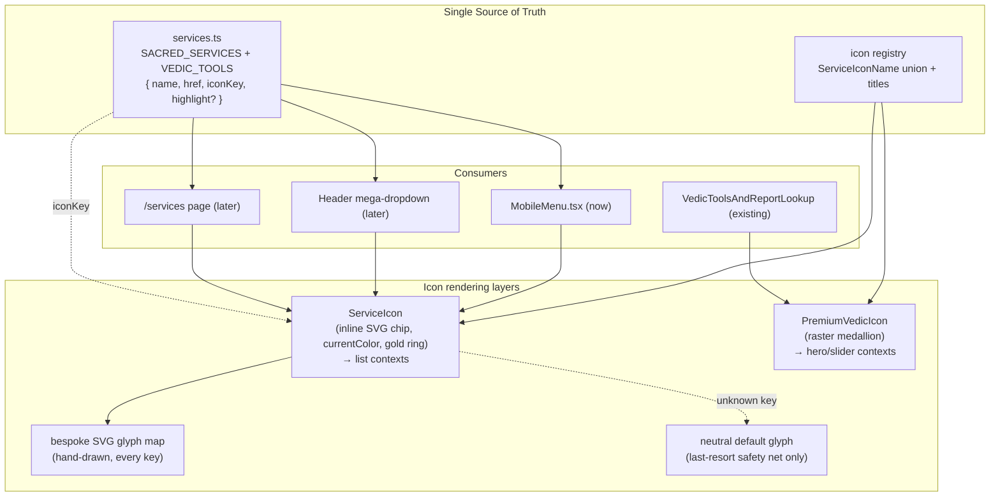

# Design Document: Premium Unified Iconography System

## Overview

ShubhMarg lists its sacred services and Vedic tools in several places. The mobile
directory menu (`src/components/layout/MobileMenu.tsx`) currently bakes **emoji
directly into the item `name` strings** (`👶 Baby Cosmic Certificate`,
`🚨 Emergency Graha SOS`, `💀 Kaal Sarp Dosha Scanner`, ...) while many items have
**no icon at all**. Emoji render inconsistently per device/OS, look cheap next to
the bright temple aesthetic, and — because only some rows carry one — the list
reads as uneven and unfinished. There are two arrays: `SACRED_SERVICES` (6 items)
and `VEDIC_TOOLS` (38 items).

A premium icon foundation already exists: `VedicArtifactIcon` re-exports
`PremiumVedicIcon`, which is keyed by a ~21-entry name union (`decision-clock`,
`diya-shrine`, `kundli-engine`, ...). The homepage tools slider
(`VedicToolsAndReportLookup.tsx`) already consumes it successfully. **Grounded
finding worth flagging up front:** `PremiumVedicIcon` does **not** render inline
`currentColor` SVG — it renders **raster medallion assets** (`.webp` with `.png`
fallback) from `/public/vedic-icons/`, sized ~48–52px, on a **dark obsidian
medallion** with heavy drop shadows. That look is right for a large hero card but
is wrong for a bright, card-less mobile list row at 28–32px (off-brand dark boxes,
40+ raster requests on a mobile menu, no theme inheritance).

This design therefore introduces a **second, lightweight icon layer** —
`ServiceIcon`, an inline-SVG, `currentColor`, gold-ring **chip** — as the source
of truth for *list contexts* (mobile menu now, Header mega-dropdown and `/services`
later), while the existing raster `PremiumVedicIcon` medallion is retained for
large hero/slider contexts. Both layers share **one icon-key registry and one
service data module**, so a tool is defined once and rendered correctly at any
scale. The refactor strips every emoji out of the menu and gives every item an
explicit `iconKey`.

**Decision (locked):** the target and shipped state is a **single cohesive set of
hand-drawn bespoke inline-SVG icons** — real SVG path data authored in-code by us —
for **every** `iconKey`. There is **no** `lucide-react` fallback as the intended
solution. All glyphs share one gold stroke style on a common key-shape grid,
transparent background, `currentColor`, drawn from temple/Vedic line-art motifs
(diya flame, kundli chart, peacock feather, conch, trishul, lotus, shield/kavach,
vault, compass/yantra, sound waveform, karmic scale, etc.). A single neutral
default glyph exists **only** as a last-resort safety net if an unknown key is ever
requested — never emoji, never raster.

**Honest limitation (stated up front):** the agent authors **SVG path data
directly** — it does not generate raster or image-file artwork. The bespoke set is
therefore hand-drawn line art in code. If the owner later supplies polished
raster/vector artwork for a given key, it can replace that key's bespoke glyph with
**zero consumer changes**, because the `ServiceIcon` layer and the registry API stay
identical.

---

# PART A — HIGH-LEVEL DESIGN

## Architecture

The system is four cooperating pieces plus a single source-of-truth data module:

1. **Icon-key registry** — the extended `ServiceIconName` union (existing 21 keys
   + ~15 new keys for menu tools that lack one). One canonical string per tool.
2. **`ServiceIcon` component** — renders a lightweight inline-SVG glyph inside a
   bright gold-ringed circular chip. Uses `currentColor` so saffron/gold is
   inherited from the row. This is the icon used in *lists*.
3. **Bespoke SVG glyph map (the whole set)** — inline React SVG paths hand-drawn
   in-code for **every** key: one stroke weight, one key-shape grid, transparent
   background, `currentColor`, temple/Vedic line-art motifs. This is the intended
   and shipped source of art — not a partial set.
4. **Neutral default glyph (safety net only)** — a single inline-SVG default (e.g.
   a simple sparkle/asterisk) rendered **only** if an unknown key is ever requested.
   Never emoji, never raster. This is a defensive guard, not a design path.
5. **`services` data module (source of truth)** — `SACRED_SERVICES` and
   `VEDIC_TOOLS` move here as typed entries `{ name, href, iconKey, highlight? }`
   with **no emoji** in `name`. MobileMenu (and later Header / `/services`) import
   from here instead of hardcoding.



## Components and Interfaces

### Component 1: `ServiceIcon`

**Purpose**: Render one icon-key as a bright, gold-ringed circular chip containing
its bespoke hand-drawn inline SVG. This is the *only* icon component used in list
rows.

**Responsibilities**:
- Resolve `iconKey` → its bespoke SVG glyph. If the key is unknown (should never
  happen given the compile-time union), fall back to a single neutral default
  glyph (never blank, never emoji, never raster).
- Draw the gold ring + cream/ivory chip per design-system tokens.
- Inherit accent color via `currentColor`; expose `aria-label` for a11y.
- Support `size` (default 30px for menu) and optional subtle GPU-safe hover.

### Component 2: Icon registry (module, not a React component)

**Purpose**: Own the `ServiceIconName` union, human-readable titles, and the
bespoke glyph map covering every key. Single place to add a new tool's icon.

**Responsibilities**:
- Export `ServiceIconName` (superset of `PremiumVedicIconName`).
- Export `SERVICE_ICON_TITLES` for aria-labels.
- Export `resolveIcon(key)` → `{ kind: "svg" | "default", Glyph }`. Every enumerated
  key resolves to a bespoke `"svg"` glyph; `"default"` is reserved for the
  unreachable unknown-key path only.

### Component 3: `services` data module

**Purpose**: Single typed list of every service/tool with its `iconKey`, so icons
are never hardcoded in three components.

**Responsibilities**:
- Export `SACRED_SERVICES: ServiceEntry[]` and `VEDIC_TOOLS: ServiceEntry[]`.
- Guarantee `name` contains no emoji and every entry has a valid `iconKey`.

## Data Models

### Model: `ServiceEntry`

```typescript
interface ServiceEntry {
  /** Display label, emoji-free. e.g. "Baby Cosmic Certificate" */
  name: string;
  /** Route, e.g. "/baby-cosmic-blueprint" */
  href: string;
  /** Canonical icon key from the registry union. */
  iconKey: ServiceIconName;
  /** Optional: featured row (saffron gradient treatment). */
  highlight?: boolean;
}
```

**Validation rules**:
- `name` MUST NOT contain emoji or pictographic characters.
- `href` MUST start with `/`.
- `iconKey` MUST be a member of `ServiceIconName` (compile-time enforced).
- Every `VEDIC_TOOLS` / `SACRED_SERVICES` entry MUST define `iconKey`.

### Where the single source of truth lives

`src/data/services.ts` (new). It imports `ServiceIconName` from the registry
(`src/components/ui/service-icons/registry.ts`). MobileMenu, the future Header
mega-dropdown, and `/services` all import arrays from here — icons and labels are
defined exactly once.

## Error Handling

| Scenario | Condition | Response | Recovery |
|----------|-----------|----------|----------|
| Unknown key | `iconKey` not in the bespoke glyph map | `ServiceIcon` renders the single neutral default inline-SVG glyph in the gold chip (never blank, never emoji, never raster) | Log a dev-only warning; the type union prevents this at compile time — this is a defensive safety net only |
| Richer art wanted later | Owner supplies polished raster/vector artwork for a key | Swap that key's entry in the glyph map | Zero consumer changes — `ServiceIcon` API and registry stay identical |
| Reduced motion | `prefers-reduced-motion` | Hover scale/transition disabled | Static chip still fully legible |

## Testing Strategy

- **Unit**: `resolveIcon` returns `kind: "svg"` with a renderable bespoke glyph for
  **every** enumerated `ServiceIconName`; the `"default"` safety net is only hit for
  a synthetic unknown key. Every `ServiceEntry.name` is emoji-free (regex assertion
  over the data module); every `iconKey` resolves to a renderable icon.
- **Type-level**: `ServiceEntry.iconKey: ServiceIconName` makes an invalid key a
  compile error — the strongest guarantee.
- **Visual/manual**: owner spot-checks the menu on a real iPhone (agent cannot
  render or test devices) to confirm chip contrast, ring, and alignment.

## Performance Considerations

- Inline SVG with `currentColor` — zero network requests for glyphs, no 40+ raster
  loads in the menu (the current medallion approach would fetch dozens of `.webp`).
- Bespoke glyphs are simple line paths (few nodes each), so the whole set adds only
  a small amount of static, tree-shakeable JSX — no runtime cost, no external art.
- Animate only `transform`/`opacity` on hover (motion rules); no width/height/box-shadow loops.

## Security Considerations

Icons are static, inline, no user input, no `dangerouslySetInnerHTML`. Nothing new.

## Dependencies

- Existing: `framer-motion`, `next/link`, `@/utils/cn`. (`lucide-react` remains a
  project dependency for general UI chrome — chevrons, close buttons, etc. — but is
  **not** used as an icon source for service glyphs.)
- New source files: `src/data/services.ts`, `src/components/ui/service-icons/`.
- **Owner input (called out):** none required to ship. Every glyph is hand-authored
  bespoke inline SVG by default. Owner-supplied polished raster/vector artwork is
  **optional** and only if richer detail is wanted later — it drops into the glyph
  map with zero consumer changes. No emoji or raster is introduced under any path.

---

# PART B — LOW-LEVEL DESIGN

## Core Interfaces / Types

```typescript
// src/components/ui/service-icons/registry.ts
import type { PremiumVedicIconName } from "@/components/ui/PremiumVedicIcon";

// Existing 21 keys (reused as-is from PremiumVedicIcon), plus ~15 new keys
// for menu tools that had no icon. New keys are additive — nothing is removed.
export type ServiceIconName =
  // ---- existing (reuse) ----
  | "decision-clock" | "diya-shrine" | "kundli-engine" | "name-analysis"
  | "vastu-scanner" | "kundli-milan" | "planetary-transits" | "karma-reader"
  | "spouse-blueprint" | "manglik-rescue" | "muhurta-finder" | "garbh-sanskar"
  | "dream-decoder" | "chakra-scanner" | "japa-mala" | "karmic-debt"
  | "ayurveda-prakriti" | "disha-shoola" | "palm-scanner" | "gemstone-calculator"
  | "kula-calculator"
  // ---- new (bespoke hand-drawn SVG) ----
  | "rajayoga-scanner" | "yoni-wheel" | "vastu-compass" | "karmic-rin-resolver"
  | "shani-sade-sati" | "navamsha-d9" | "pitru-vault" | "yantra-altar"
  | "sound-sanctuary" | "deepdaan-sanctum" | "prasad-tracker" | "kundli-xray"
  | "kuldevta-resolver" | "baby-cosmic" | "graha-sos" | "kaal-sarp"
  | "wealth-calendar" | "raksha-kavach"
  // ---- sacred-list keys ----
  | "sacred-offerings" | "temple-puja" | "tatkal-express" | "voice-dossier"
  | "annual-varshphal" | "energized-gemstone";

export type IconResolution =
  // Every enumerated key resolves to a bespoke hand-drawn inline-SVG glyph.
  | { kind: "svg";     Glyph: React.FC<{ className?: string }> }
  // "default" is the last-resort neutral glyph for an unknown key only.
  | { kind: "default"; Glyph: React.FC<{ className?: string }> };

export const SERVICE_ICON_TITLES: Record<ServiceIconName, string>;
export function resolveIcon(key: ServiceIconName): IconResolution;
```

## Menu data shape after refactor

Emoji stripped from every `name`; each entry gains an `iconKey`.

```typescript
// src/data/services.ts
import type { ServiceIconName } from "@/components/ui/service-icons/registry";

export interface ServiceEntry {
  name: string;
  href: string;
  iconKey: ServiceIconName;
  highlight?: boolean;
}

export const SACRED_SERVICES: ServiceEntry[] = [
  { name: "Sacred Offerings & Pujas",     href: "/sacred-offerings", iconKey: "sacred-offerings", highlight: true },
  { name: "Remote Temple Sankalp Puja",   href: "/request-guidance?service=temple-puja",       iconKey: "temple-puja" },
  { name: "2-Hour Tatkal Express",        href: "/request-guidance?service=tatkal-express",     iconKey: "tatkal-express" },
  { name: "Pandit Ji Audio Dossier",      href: "/request-guidance?service=voice-dossier",      iconKey: "voice-dossier" },
  { name: "365-Day Varshphal Book",       href: "/request-guidance?service=annual-varshphal",   iconKey: "annual-varshphal" },
  { name: "Consecrated Gemstone Ring",    href: "/request-guidance?service=energized-gemstone", iconKey: "energized-gemstone" },
];

export const VEDIC_TOOLS: ServiceEntry[] = [
  { name: "Raja Yoga Scanner",          href: "/rajayoga-scanner",       iconKey: "rajayoga-scanner" },
  { name: "27 Nakshatra Yoni Wheel",    href: "/yoni-wheel",             iconKey: "yoni-wheel" },
  { name: "16-Zone Vastu Radar",        href: "/vastu-compass",          iconKey: "vastu-compass" },
  { name: "4-Rin Karmic Resolver",      href: "/karmic-rin-resolver",    iconKey: "karmic-rin-resolver" },
  { name: "Shani Sade Sati Armor",      href: "/shani-sade-sati",        iconKey: "shani-sade-sati" },
  { name: "Navamsha D9 Soulmate",       href: "/navamsha-d9",            iconKey: "navamsha-d9" },
  { name: "Golden Pitru Vault",         href: "/pitru-vault",            iconKey: "pitru-vault" },
  { name: "24K Gold Yantra Altar",      href: "/yantra-altar",           iconKey: "yantra-altar" },
  { name: "432Hz Sound Sanctum",        href: "/sound-sanctuary",        iconKey: "sound-sanctuary" },
  { name: "Virtual Deepdaan Altar",     href: "/deepdaan-sanctum",       iconKey: "deepdaan-sanctum" },
  { name: "Live Prasad Tracker",        href: "/prasad-tracker",         iconKey: "prasad-tracker" },
  { name: "12-House Kundli X-Ray",      href: "/kundli-xray",            iconKey: "kundli-xray" },
  { name: "Gotra Rishi & Kuldevta",     href: "/kuldevta-resolver",      iconKey: "kuldevta-resolver" },
  { name: "Samudrika Palm Scanner",     href: "/palm-scanner",           iconKey: "palm-scanner" },
  { name: "7-Chakra Aura Scanner",      href: "/chakra-scanner",         iconKey: "chakra-scanner" },
  { name: "3D Planetary Transits",      href: "/transit-wheel",          iconKey: "planetary-transits" },
  { name: "36-Guna Kundli Milan",       href: "/compatibility",          iconKey: "kundli-milan" },
  { name: "Swapna Dream Decoder",       href: "/dream-decoder",          iconKey: "dream-decoder" },
  { name: "Live Decision Clock",        href: "/decision-clock",         iconKey: "decision-clock" },
  { name: "Ratna & Rudraksha",          href: "/gemstone-calculator",    iconKey: "gemstone-calculator" },
  { name: "Ancestral Karmic Debt",      href: "/karmic-debt",            iconKey: "karmic-debt" },
  { name: "Ayurveda Prakriti Diet",     href: "/ayurveda-prakriti",      iconKey: "ayurveda-prakriti" },
  { name: "Vedic Vastu Scanner",        href: "/vastu-scanner",          iconKey: "vastu-scanner" },
  { name: "108 Digital Japa Mala",      href: "/japa-mala",              iconKey: "japa-mala" },
  { name: "Virtual Diya Shrine",        href: "/digital-sankalp",        iconKey: "diya-shrine" },
  { name: "Disha Shoola Radar",         href: "/disha-shoola",           iconKey: "disha-shoola" },
  { name: "Prashna Horary Engine",      href: "/prashna-kundli",         iconKey: "kundli-engine" },
  { name: "Vedic Namkaran Engine",      href: "/name-calculator",        iconKey: "name-analysis" },
  { name: "Baby Cosmic Certificate",    href: "/baby-cosmic-blueprint",  iconKey: "baby-cosmic" },
  { name: "Emergency Graha SOS",        href: "/graha-sos",              iconKey: "graha-sos" },
  { name: "Kaal Sarp Dosha Scanner",    href: "/dosha-scanner",          iconKey: "kaal-sarp" },
  { name: "Vedic Wealth Calendar",      href: "/wealth-calendar",        iconKey: "wealth-calendar" },
  { name: "Raksha Kavach QR Card",      href: "/raksha-kavach",          iconKey: "raksha-kavach" },
  { name: "Past-Life Karmic Reader",    href: "/past-life-reader",       iconKey: "karma-reader" },
  { name: "Future Spouse Blueprint",    href: "/spouse-predictor",       iconKey: "spouse-blueprint" },
  { name: "Manglik Marriage Rescue",    href: "/manglik-rescue",         iconKey: "manglik-rescue" },
  { name: "Universal Muhurta Finder",   href: "/muhurta-finder",         iconKey: "muhurta-finder" },
  { name: "Garbh Sanskar Sanctum",      href: "/garbh-sanskar",          iconKey: "garbh-sanskar" },
];
```

## Icon-chip render (JSX / pseudocode)

Bright chip, gold ring, `currentColor` glyph, GPU-safe hover only. Note the chip
is cream/ivory with a `#B8860B` ring and a saffron `currentColor` glyph — **not** a
dark box, per design-system. The glyph is always a bespoke hand-drawn inline SVG.

```tsx
// src/components/ui/service-icons/ServiceIcon.tsx
import { resolveIcon, SERVICE_ICON_TITLES, ServiceIconName } from "./registry";

interface ServiceIconProps {
  iconKey: ServiceIconName;
  size?: number;          // default 30 (menu row)
  className?: string;
  ariaLabel?: string;
}

export default function ServiceIcon({
  iconKey, size = 30, className = "", ariaLabel,
}: ServiceIconProps) {
  const { Glyph } = resolveIcon(iconKey);
  const label = ariaLabel ?? SERVICE_ICON_TITLES[iconKey] ?? `${iconKey} icon`;

  return (
    <span
      role="img"
      aria-label={label}
      style={{ width: size, height: size }}
      className={cn(
        // bright chip — ivory fill, gold ring (NOT a dark box)
        "inline-flex items-center justify-center shrink-0 rounded-full",
        "bg-[#FFFDF8] ring-1 ring-[#B8860B]/35",
        // saffron glyph via currentColor; subtle GPU-safe hover
        "text-[#C25E10] transition-transform duration-200 ease-out",
        "group-hover:scale-105 motion-reduce:transform-none",
        className,
      )}
    >
      {/* Glyph draws with stroke/fill = currentColor, ~60% of chip size */}
      <Glyph className="w-[60%] h-[60%]" />
    </span>
  );
}
```

Render pseudocode for the resolver + last-resort safety net:

```pascal
PROCEDURE resolveIcon(key)
  INPUT: key of type ServiceIconName
  OUTPUT: IconResolution { kind, Glyph }

  // BESPOKE_SVG_MAP contains a hand-drawn inline-SVG glyph for EVERY key.
  IF BESPOKE_SVG_MAP contains key THEN
    RETURN { kind: "svg", Glyph: BESPOKE_SVG_MAP[key] }
  ELSE
    // Unreachable for valid keys (compile-time union). Last-resort safety net
    // only — a single neutral inline-SVG glyph. Never blank, never emoji, never raster.
    RETURN { kind: "default", Glyph: DefaultGlyph }
  END IF
END PROCEDURE
```

Menu row after refactor (leading chip replaces emoji; row layout unchanged):

```tsx
{VEDIC_TOOLS.map((tool) => (
  <Link key={tool.href} href={tool.href} onClick={() => setIsOpen(false)}
    className="group p-3 rounded-2xl bg-[#FFFDF8] hover:bg-[#FDF3E2]
               border border-[#B8860B]/15 text-xs text-[#2A1810]
               flex items-center gap-2.5 shadow-sm transition-colors">
    <ServiceIcon iconKey={tool.iconKey} size={28} />
    <span className="flex-1">{tool.name}</span>
    <ChevronRight className="w-3 h-3 text-[#B8860B]/70" />
  </Link>
))}
```

## Rule for choosing / adding an icon per item

1. **Reuse** an existing bespoke key if the tool already has one (semantic match,
   not just visual). Preferred — keeps the set coherent.
2. Else **author a bespoke inline-SVG glyph** for it: single gold stroke weight,
   drawn on the same key-shape grid, `currentColor`, transparent background, from a
   temple/Vedic line-art motif. This is the intended and shipped state for every
   new key — not an interim.
3. The single neutral **default glyph** is used **only** if an unknown (non-union)
   key is ever passed — a defensive safety net, not a design choice.
4. Never emoji, never raster, never a blank. No `lucide-react` glyph is used as a
   service icon.

## Enumerated mapping table — every current MobileMenu item → iconKey

Legend: **REUSE** = existing bespoke key/glyph reused as-is · **NEW-SVG** = new
bespoke hand-drawn inline SVG authored in-code. Every item is one or the other —
there is no lucide/interim path. The motif column names the temple/Vedic line-art
idea each new glyph draws from.

### SACRED_SERVICES

| # | Current name (emoji stripped) | href | iconKey | Source | Motif |
|---|-------------------------------|------|---------|--------|-------|
| 1 | Sacred Offerings & Pujas | /sacred-offerings | `sacred-offerings` | NEW-SVG | diya flame over offering bowl |
| 2 | Remote Temple Sankalp Puja | ?service=temple-puja | `temple-puja` | NEW-SVG | temple shikhara / mandir arch |
| 3 | 2-Hour Tatkal Express | ?service=tatkal-express | `tatkal-express` | NEW-SVG | swift bolt through a bell |
| 4 | Pandit Ji Audio Dossier | ?service=voice-dossier | `voice-dossier` | NEW-SVG | conch shell (shankh) sound |
| 5 | 365-Day Varshphal Book | ?service=annual-varshphal | `annual-varshphal` | NEW-SVG | open pothi/almanac book |
| 6 | Consecrated Gemstone Ring | ?service=energized-gemstone | `energized-gemstone` | REUSE `gemstone-calculator` glyph | faceted gem |

### VEDIC_TOOLS

| # | Current name (emoji stripped) | href | iconKey | Source | Motif |
|---|-------------------------------|------|---------|--------|-------|
| 1 | Raja Yoga Scanner | /rajayoga-scanner | `rajayoga-scanner` | NEW-SVG | crown / royal throne line |
| 2 | 27 Nakshatra Yoni Wheel | /yoni-wheel | `yoni-wheel` | NEW-SVG | 27-spoke star wheel |
| 3 | 16-Zone Vastu Radar | /vastu-compass | `vastu-compass` | NEW-SVG | 8-direction compass rose |
| 4 | 4-Rin Karmic Resolver | /karmic-rin-resolver | `karmic-rin-resolver` | NEW-SVG | balance scale |
| 5 | Shani Sade Sati Armor | /shani-sade-sati | `shani-sade-sati` | NEW-SVG | protective shield |
| 6 | Navamsha D9 Soulmate | /navamsha-d9 | `navamsha-d9` | NEW-SVG | twin lotus / joined hearts |
| 7 | Golden Pitru Vault | /pitru-vault | `pitru-vault` | NEW-SVG | vault door / kalash urn |
| 8 | 24K Gold Yantra Altar | /yantra-altar | `yantra-altar` | NEW-SVG | Sri Yantra triangles |
| 9 | 432Hz Sound Sanctum | /sound-sanctuary | `sound-sanctuary` | NEW-SVG | Om / sound waveform |
| 10 | Virtual Deepdaan Altar | /deepdaan-sanctum | `deepdaan-sanctum` | REUSE `diya-shrine` | diya lamp |
| 11 | Live Prasad Tracker | /prasad-tracker | `prasad-tracker` | NEW-SVG | offering thali / parcel |
| 12 | 12-House Kundli X-Ray | /kundli-xray | `kundli-xray` | NEW-SVG | North-Indian kundli chart |
| 13 | Gotra Rishi & Kuldevta | /kuldevta-resolver | `kuldevta-resolver` | NEW-SVG | temple shrine / deity |
| 14 | Samudrika Palm Scanner | /palm-scanner | `palm-scanner` | REUSE | open palm lines |
| 15 | 7-Chakra Aura Scanner | /chakra-scanner | `chakra-scanner` | REUSE | stacked chakra column |
| 16 | 3D Planetary Transits | /transit-wheel | `planetary-transits` | REUSE | orbiting planets |
| 17 | 36-Guna Kundli Milan | /compatibility | `kundli-milan` | REUSE | joined charts |
| 18 | Swapna Dream Decoder | /dream-decoder | `dream-decoder` | REUSE | crescent moon / cloud |
| 19 | Live Decision Clock | /decision-clock | `decision-clock` | REUSE | clock dial |
| 20 | Ratna & Rudraksha | /gemstone-calculator | `gemstone-calculator` | REUSE | faceted gem |
| 21 | Ancestral Karmic Debt | /karmic-debt | `karmic-debt` | REUSE | ledger / knot |
| 22 | Ayurveda Prakriti Diet | /ayurveda-prakriti | `ayurveda-prakriti` | REUSE | herb leaf / mortar |
| 23 | Vedic Vastu Scanner | /vastu-scanner | `vastu-scanner` | REUSE | floor-plan grid |
| 24 | 108 Digital Japa Mala | /japa-mala | `japa-mala` | REUSE | mala beads |
| 25 | Virtual Diya Shrine | /digital-sankalp | `diya-shrine` | REUSE | diya lamp |
| 26 | Disha Shoola Radar | /disha-shoola | `disha-shoola` | REUSE | direction arrows |
| 27 | Prashna Horary Engine | /prashna-kundli | `kundli-engine` | REUSE | chart engine |
| 28 | Vedic Namkaran Engine | /name-calculator | `name-analysis` | REUSE | Devanagari akshar |
| 29 | Baby Cosmic Certificate | /baby-cosmic-blueprint | `baby-cosmic` | NEW-SVG | cradle under a star |
| 30 | Emergency Graha SOS | /graha-sos | `graha-sos` | NEW-SVG | alert planet / beacon |
| 31 | Kaal Sarp Dosha Scanner | /dosha-scanner | `kaal-sarp` | NEW-SVG | coiled serpent (naga) |
| 32 | Vedic Wealth Calendar | /wealth-calendar | `wealth-calendar` | NEW-SVG | calendar with coin/lotus |
| 33 | Raksha Kavach QR Card | /raksha-kavach | `raksha-kavach` | NEW-SVG | kavach amulet / talisman |
| 34 | Past-Life Karmic Reader | /past-life-reader | `karma-reader` | REUSE | karmic wheel |
| 35 | Future Spouse Blueprint | /spouse-predictor | `spouse-blueprint` | REUSE | paired figures |
| 36 | Manglik Marriage Rescue | /manglik-rescue | `manglik-rescue` | REUSE | Mars / union knot |
| 37 | Universal Muhurta Finder | /muhurta-finder | `muhurta-finder` | REUSE | auspicious hourglass |
| 38 | Garbh Sanskar Sanctum | /garbh-sanskar | `garbh-sanskar` | REUSE | lotus womb / cradle |

**Summary:** 27 REUSE existing bespoke keys · 17 NEW-SVG bespoke hand-drawn glyphs
(6 in SACRED_SERVICES + 11 in VEDIC_TOOLS). Every key ships as bespoke inline SVG —
there is no lucide/interim path. If the owner later supplies polished raster/vector
artwork for any key, it replaces that key's bespoke glyph with zero consumer changes.

## Migration approach

1. Add `src/components/ui/service-icons/registry.ts` (union + titles + resolver +
   the bespoke inline-SVG glyph map covering every key + the single neutral default
   glyph) and `ServiceIcon.tsx`. Hand-author path data for each NEW-SVG key on the
   shared stroke/grid; wire REUSE keys to their existing bespoke glyphs.
2. Add `src/data/services.ts` with the emoji-free typed arrays above.
3. Refactor `MobileMenu.tsx`: delete the two inline arrays, import from
   `@/data/services`, render `<ServiceIcon iconKey={item.iconKey} />` as the
   leading chip; keep card-less row layout, spacing, and ChevronRight intact.
   Also replace the two hardcoded emoji in the quick-links banner (`📅`, `💬`) and
   the `🔮` section header with bespoke inline-SVG glyphs for full consistency.
4. Run `npm run build`; confirm zero errors and no emoji remain in the menu.
5. Later (out of scope for this spec's first task set): point the Header
   mega-dropdown and `/services` at the same `services.ts` and `ServiceIcon`.

## Correctness Properties

- **P1 (no emoji):** `∀ e ∈ (SACRED_SERVICES ∪ VEDIC_TOOLS): ¬containsEmoji(e.name)`.
- **P2 (total bespoke coverage):** `∀ e: e.iconKey ∈ ServiceIconName` (compile-time)
  and `resolveIcon(e.iconKey).kind = "svg"` with a renderable bespoke glyph (never
  null/blank, never the default). The `"default"` glyph is reachable only for a
  synthetic unknown key.
- **P3 (single source):** MobileMenu holds no inline service array and no hardcoded
  icon; it reads only from `services.ts`.
- **P4 (bright chip):** `ServiceIcon` chip uses ivory fill + `#B8860B` ring +
  saffron `currentColor` glyph — never a dark boxed tile.
- **P5 (motion-safe):** only `transform` animates on hover; disabled under
  `prefers-reduced-motion`.

## Owner input that may be required

- **None to ship.** All 17 NEW-SVG keys are hand-authored bespoke inline SVGs by
  default, matching the shared gold stroke style and key-shape grid. The menu ships
  as a complete, cohesive bespoke set with no owner action.
- **Optional, later:** if the owner wants richer detail than hand-drawn line art,
  they may supply polished raster/vector artwork for any key. Since the agent
  authors SVG path data directly (it cannot generate raster/image files), such
  artwork is the only way to go beyond line-art fidelity. Any supplied asset drops
  into the glyph map and replaces that key's bespoke glyph with **zero consumer
  changes** — the `ServiceIcon` layer and registry API stay identical. No emoji or
  raster is introduced under any default path.
