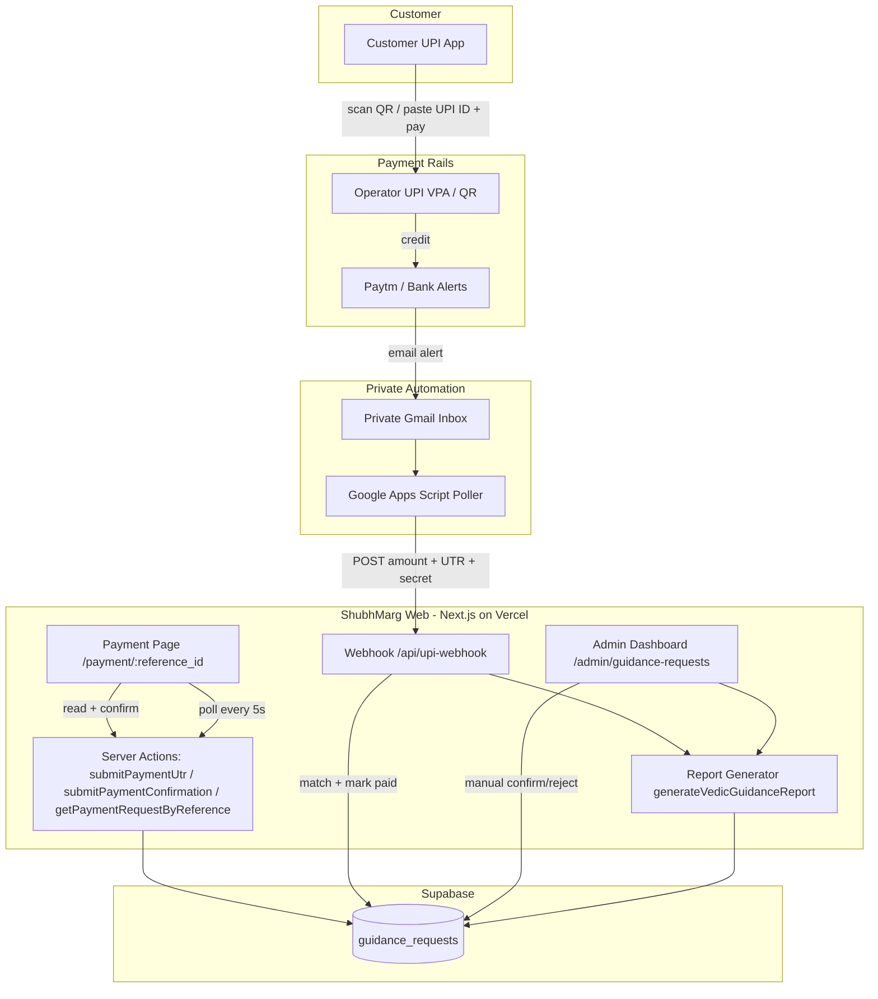
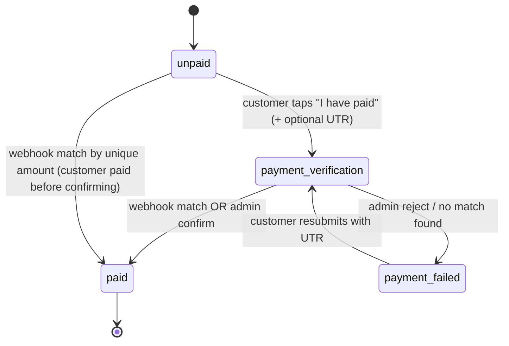
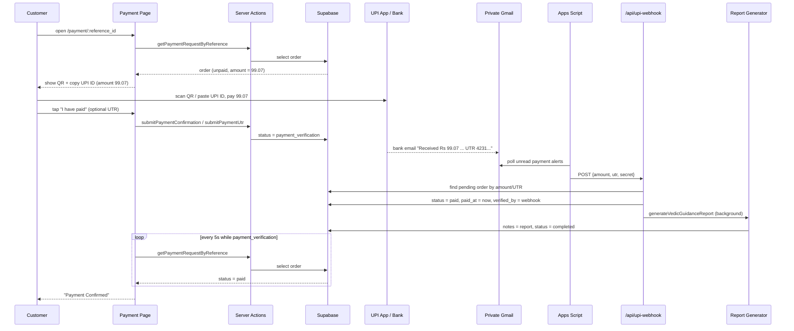
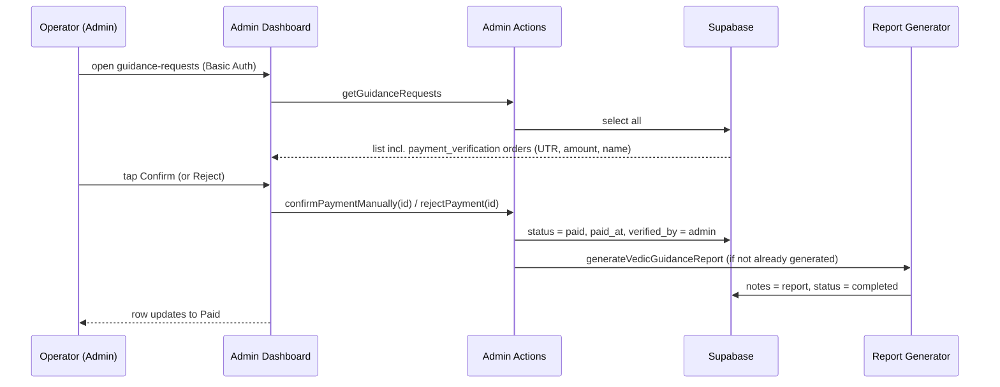
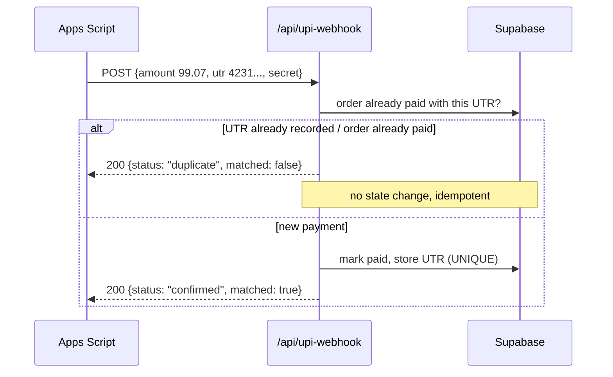
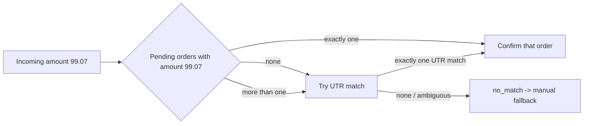

# Design Document: UPI Payment + Automatic Verification

## Overview

ShubhMarg sells Vedic guidance reports. Because Vedic astrology is a business category that payment gateways (Razorpay, Cashfree, PayU) reject, and the operator has no GST and no confirmed Paytm PG approval, a conventional payment-gateway integration is unavailable. This system delivers reliable payment collection and near-instant automatic confirmation using only tools that work without a gateway: a UPI QR code, a copyable UPI ID, and email-alert parsing for automation.

The system has five parts working together:

1. **Payment page UX (QR-first)** — the customer pays by scanning a QR or copy/pasting the UPI ID into any UPI app, then taps "I have paid" and optionally enters a UTR. The page live-polls until the order flips to `paid`.
2. **Auto-verification webhook** (`/api/upi-webhook`) — a secret-token-protected endpoint that receives parsed payment data and matches it to a pending order, marking it `paid` and triggering report generation.
3. **Email→webhook bridge** — a Google Apps Script running in a private Gmail that receives Paytm/bank payment-received email alerts, extracts amount + UTR, and POSTs them to the webhook.
4. **Manual fallback** — the existing admin dashboard lets the operator confirm or reject pending orders one-tap when auto-verification does not fire.
5. **Config/secrets** — new environment variables (webhook secret, configurable VPA) stored in Vercel, never hardcoded.

The design's two standout mechanisms are **unique-paise amount matching** (each order is charged a slightly unique amount such as ₹99.07 so the incoming payment amount alone identifies the order) and **email-driven auto-verification** (the bridge turns a bank email alert into a webhook call, requiring no Android device and no payment gateway).

### Scope Boundaries (already decided — not re-opened here)

- One-tap UPI deep-link buttons (open-app-with-amount) do **not** work with a personal VPA or a Paytm static-QR VPA and cannot be fixed without a gateway/signing key. They are treated as **removed or best-effort-only**. The QR scan and copy-UPI-ID paths are the **primary** methods.
- The QR/intent amount **must** be formatted to two decimals (e.g. `99.00`, `99.07`), which resolved the earlier false "limit exceeded" error.
- Auto-verification is **cloud/email-based**, not Android SMS-forwarder based (operator uses iPhone).

## Architecture



### Payment lifecycle (state machine)



Note two entry paths into `paid`:
- **Normal path**: customer confirms → `payment_verification` → webhook or admin → `paid`.
- **Fast path**: the email alert arrives while the order is still `unpaid` (customer paid but hasn't tapped confirm). The webhook still matches by unique amount and marks it `paid` directly. The page's live poll then flips to "Confirmed."

## Sequence Diagrams

### Flow 1: Happy path — auto-verification via email



### Flow 2: Manual fallback



### Flow 3: Duplicate / replay protection



## Components and Interfaces

### Component 1: Payment Page (client) — `src/app/payment/[reference_id]/page.tsx`

**Purpose**: Present QR-first payment instructions, capture "I have paid" + optional UTR, and live-update to Confirmed.

**Responsibilities**:
- Render a UPI QR from a correctly formatted `upi://pay` URI with a **2-decimal** amount.
- Render a prominent, copyable UPI ID with clear paste-in-app instructions.
- Show ordered step-by-step instructions and a WhatsApp help fallback (`918169382308`).
- Provide "I have paid" action and optional 12-digit UTR entry.
- Poll `getPaymentRequestByReference` every 5s while status is `payment_verification` (and, per this design, also while `unpaid` so the fast path shows confirmation), flipping the UI to Confirmed on `paid`.
- De-emphasize or remove the non-working one-tap deep-link app buttons.

**Key interface (UPI URI builder, shared util)**:
```typescript
interface UpiIntentParams {
  payeeVpa: string;      // configurable, e.g. process.env.NEXT_PUBLIC_UPI_VPA
  payeeName: string;     // e.g. "SOURABH JAGDHARI YADAV"
  amount: number;        // rupees, may include paise (e.g. 99.07)
  currency?: string;     // default "INR"
}

// Returns "upi://pay?pa=...&pn=...&am=99.07&cu=INR"
// amount MUST be rendered with exactly 2 decimals via amount.toFixed(2)
function buildUpiUri(params: UpiIntentParams): string;
```

### Component 2: Payment Server Actions — `src/app/payment/[reference_id]/actions.ts`

**Purpose**: Read order state and record customer-side confirmation.

**Interface (existing, retained; report trigger reconsidered — see note)**:
```typescript
function getPaymentRequestByReference(referenceId: string):
  Promise<{ success: boolean; request?: PaymentRequest; error?: string }>;

function submitPaymentUtr(referenceId: string, utr: string):
  Promise<{ success: boolean; error?: string }>;

function submitPaymentConfirmation(referenceId: string):
  Promise<{ success: boolean; error?: string }>;
```

**Responsibilities**:
- Validate UTR length (8–20 chars, 12-digit typical) and format.
- Reject a UTR already attached to a different order (leveraging the UNIQUE constraint).
- Move `unpaid`/`payment_failed` → `payment_verification`, set `payment_submitted_at`.

**Design note (report trigger location)**: Today both actions trigger `generateVedicGuidanceReport` on `payment_verification`. This means reports are generated before payment is actually verified. This design **moves the authoritative report trigger to the moment the order becomes `paid`** (webhook match or admin confirm), so unpaid/unverified confirmations do not consume Gemini calls. The requirements phase will capture this as an explicit change.

### Component 3: UPI Webhook — `src/app/api/upi-webhook/route.ts` (new)

**Purpose**: Receive parsed payment data from the email bridge and confirm the matching order.

**Interface**:
```typescript
// POST /api/upi-webhook
interface UpiWebhookRequest {
  amount: number;         // rupees incl. paise, e.g. 99.07
  utr?: string;           // 12-digit UPI reference if extractable
  payerVpa?: string;      // optional, for logging/attribution
  payerName?: string;     // optional
  rawEmailId?: string;    // optional, for idempotency/audit
}

interface UpiWebhookResponse {
  status: "confirmed" | "duplicate" | "no_match" | "unauthorized" | "error";
  matched: boolean;
  referenceId?: string;   // matched order, if any
  message?: string;
}
```

**Auth**: A shared secret is required on every request. The secret is supplied via the `X-Webhook-Secret` header (preferred) and compared to `process.env.UPI_WEBHOOK_SECRET` using a constant-time comparison. Missing/incorrect secret → HTTP 401 with `status: "unauthorized"`. The route uses `export const dynamic = "force-dynamic"` and dynamic-imports `supabaseServer`, matching existing route conventions.

**Responsibilities**:
- Authenticate the caller by secret.
- Run the matching strategy (see Matching Strategy below) to find exactly one pending order.
- On a unique match: set `payment_status = paid`, `paid_at = now`, `payment_verified_by = 'webhook'`, store `payment_utr` if provided, and add a `payment_verification_note` recording amount/payer.
- Trigger `generateVedicGuidanceReport` in the background (fire-and-forget, matching existing pattern).
- Enforce duplicate/replay protection (idempotent).

### Component 4: Email→Webhook Bridge — Google Apps Script (external, versioned as `scripts/upi-email-bridge.gs`)

**Purpose**: Convert Paytm/bank payment-alert emails in a private Gmail into webhook calls.

**Responsibilities**:
- Run on a time-based trigger (e.g. every 1–2 minutes).
- Search the private inbox for unread payment-alert emails (by sender/subject filter, TBD from a real sample).
- Extract `amount` and `utr` via regex (finalized once a real Paytm alert sample is available).
- POST `{ amount, utr, payerName?, rawEmailId }` to `/api/upi-webhook` with the secret header.
- Mark processed emails read/labeled to avoid reprocessing (bridge-side idempotency, complementing webhook-side idempotency).

**Interface sketch**:
```javascript
// Pseudocode-level contract (finalized in implementation)
function pollPaymentEmails() {
  const threads = GmailApp.search('is:unread from:(paytm OR bank) "received"');
  for (const thread of threads) {
    const body = thread.getMessages()[0].getPlainBody();
    const amount = extractAmount(body);   // regex -> number with paise
    const utr = extractUtr(body);         // regex -> 12-digit string
    if (amount) postToWebhook({ amount, utr });
    thread.markRead(); // or apply "processed" label
  }
}
```

**Known unknown (explicit)**: The exact Paytm alert email format is **TBD** and requires a real sample. The regexes for `extractAmount` and `extractUtr` are placeholders until that sample is captured. This is called out as a requirement/assumption so it is not lost.

### Component 5: Admin Manual Fallback — `src/app/admin/guidance-requests/*`

**Purpose**: Let the operator confirm or reject pending payments when auto-verification does not fire.

**Interface (extends existing admin actions)**:
```typescript
// Reuses existing updatePaymentStatus(id, status, note) which already sets paid_at on 'paid'
function confirmPaymentManually(id: string, note?: string):
  Promise<{ success: boolean; error?: string }>; // sets paid, paid_at, verified_by='admin', triggers report

function rejectPayment(id: string, note?: string):
  Promise<{ success: boolean; error?: string }>; // sets payment_failed with reason note
```

**Responsibilities**:
- List `payment_verification` orders with claimed UTR, amount, and name (data already fetched by `getGuidanceRequests`).
- Confirm → `paid` (+ `paid_at`, `payment_verified_by='admin'`) and trigger report if not already generated.
- Reject → `payment_failed` with a note; the customer page shows the resubmit-with-UTR prompt.
- All admin actions remain behind existing Basic Auth (`verifyAdminAuth`).

## Data Models

### Model: `guidance_requests` (payment-relevant fields)

Existing columns (migration `02_add_payment_fields.sql`):
```typescript
interface GuidanceRequestPayment {
  id: string;
  reference_id: string;                 // UNIQUE
  full_name: string;
  service: string;
  email: string | null;
  payment_status: 'unpaid' | 'payment_verification' | 'paid' | 'payment_failed' | 'refunded';
  payment_amount: number | null;        // see schema change note below
  payment_currency: string;             // 'INR'
  payment_utr: string | null;           // UNIQUE — replay protection
  payment_submitted_at: string | null;
  paid_at: string | null;
  payment_verified_by: string | null;   // 'webhook' | 'admin' | null
  payment_verification_note: string | null;
}
```

**Schema change required for unique-paise matching**: `payment_amount` is currently `INTEGER`, which cannot store `99.07`. To use the unique-paise technique, the column must become `NUMERIC(10,2)` (rupees with paise) — or amounts must be stored in integer **paise** (e.g. `9907`). This design recommends `NUMERIC(10,2)` for readability and to match the 2-decimal UPI amount. A new migration (`03_payment_amount_decimal.sql`) is captured in requirements.

**Validation rules**:
- `payment_amount` > 0, at most 2 decimal places.
- `payment_utr`, when present, is 8–20 chars (12 digits typical) and unique across orders.
- `payment_status` transitions follow the state machine above.

### Matching Strategy (the core of auto-verification)

The webhook must map an incoming `{amount, utr}` to exactly one order. Two complementary strategies:

**Strategy A — Unique-paise amount (primary, recommended)**
- Each order is assigned a base price plus a small **unique paise offset** so no two concurrently-pending orders share the same amount (e.g. ₹99.01, ₹99.02, … ₹99.99, then ₹100.01, …).
- The offset is derived at order-creation time and stored in `payment_amount`.
- On webhook, match `payment_amount == incoming.amount` among orders in `unpaid`/`payment_verification`.
- Because ~99 distinct offsets exist per rupee band, collisions are avoided by (a) allocating an offset not currently in use among pending orders, and/or (b) spanning multiple rupee bands. Collision handling: if more than one pending order matches an amount, fall back to UTR match; if still ambiguous, do **not** auto-confirm — route to manual fallback.



**Strategy B — UTR match (secondary / corroborating)**
- If the customer entered a UTR and the email alert also yields a UTR, match on `payment_utr`.
- Also used to disambiguate when amount matching is not unique.

**Duplicate/replay protection**:
- Before confirming, check whether the order is already `paid` or whether the incoming UTR already exists on any order. If so, respond `duplicate` with no state change (idempotent).
- The `payment_utr` UNIQUE constraint is the database-level backstop against double-processing the same payment.

## Error Handling

### Scenario 1: Invalid or missing webhook secret
**Condition**: `X-Webhook-Secret` header absent or not equal to `UPI_WEBHOOK_SECRET`.
**Response**: HTTP 401, `{ status: "unauthorized", matched: false }`. No DB read of order data beyond what's needed; no state change.
**Recovery**: Bridge alerts operator via logs; operator re-checks the secret in Vercel and Apps Script.

### Scenario 2: No matching pending order
**Condition**: No pending order matches the amount, and no UTR match.
**Response**: HTTP 200, `{ status: "no_match", matched: false }`. Payment is logged for manual review.
**Recovery**: Operator uses the admin fallback to confirm manually once they reconcile the payment.

### Scenario 3: Ambiguous match (multiple pending orders, same amount, no UTR)
**Condition**: More than one pending order shares the incoming amount and UTR cannot disambiguate.
**Response**: HTTP 200, `{ status: "no_match", matched: false }` with a note; **no auto-confirm**.
**Recovery**: Manual fallback. (Prevented in practice by unique-paise allocation.)

### Scenario 4: Duplicate / replayed alert
**Condition**: Order already `paid`, or incoming UTR already recorded.
**Response**: HTTP 200, `{ status: "duplicate", matched: false }`. Idempotent, no change.
**Recovery**: None needed; safe to reprocess.

### Scenario 5: Report generation fails after successful match
**Condition**: `generateVedicGuidanceReport` throws (e.g. Gemini error).
**Response**: Payment remains `paid` (verification succeeded). Report error is logged (matching existing background-catch pattern). Admin can re-trigger via existing `triggerAiReportGeneration`.
**Recovery**: Operator re-runs report generation from admin.

### Scenario 6: Customer enters a UTR already used by another order
**Condition**: `submitPaymentUtr` finds the UTR on a different order.
**Response**: Action returns `{ success: false, error }`; UI shows a message. (Existing behavior retained.)
**Recovery**: Customer re-checks their UTR; WhatsApp fallback available.

### Scenario 7: Malformed webhook payload
**Condition**: Missing/invalid `amount`.
**Response**: HTTP 400, `{ status: "error", matched: false }`.
**Recovery**: Bridge logs and retries on next poll; email left unprocessed.

## Testing Strategy

### Unit Testing Approach
- `buildUpiUri`: amount is always formatted to exactly 2 decimals; params URL-encoded; VPA/name/currency present.
- Matching logic: given a set of pending orders and an incoming `{amount, utr}`, returns the correct single order, `no_match`, or `duplicate`.
- Secret comparison: unauthorized on wrong/missing secret.
- Regex extractors (`extractAmount`, `extractUtr`): once a real Paytm sample exists, unit-test against captured sample bodies.

### Property-Based Testing Approach
Suitable because matching and UPI-URI formatting are pure functions over structured inputs with meaningful input variation.

**Property Test Library**: `fast-check` (TypeScript/JS ecosystem).

Candidate properties (formalized in the Correctness Properties section after requirements are derived):
- UPI URI amount always has 2 decimals for any positive amount.
- Unique-paise allocation never assigns a duplicate amount among concurrently pending orders.
- Webhook processing is idempotent: replaying the same alert never changes state after the first confirmation.
- A confirmed order transitions only along legal state-machine edges.

### Integration Testing Approach
- Webhook end-to-end against a test Supabase row: unpaid order → POST alert → order becomes `paid`, `paid_at` set, report trigger invoked (mock Gemini).
- Admin confirm/reject against a test row.
- 1–3 representative examples only (external I/O, not property-tested).

## Security Considerations

- **Webhook auth**: shared secret in `X-Webhook-Secret`, constant-time compared; never logged. Endpoint returns 401 without leaking whether an order exists.
- **Secrets management**: `UPI_WEBHOOK_SECRET` and any VPA config live in Vercel env vars and Apps Script properties. Never hardcoded, never committed. `.env.example` documents key names only.
- **Service-role usage**: webhook uses `supabaseServer` (service role, bypasses RLS) consistent with existing server code; it must validate the secret before any privileged DB write.
- **Replay safety**: `payment_utr` UNIQUE + idempotent duplicate handling prevents double-confirmation.
- **Amount tampering**: the webhook confirms only against amounts the system itself assigned to pending orders; it never trusts an arbitrary caller to name an order directly without matching.
- **PII**: payer name/VPA from alerts are stored only in `payment_verification_note` for reconciliation; no secrets echoed in responses.

## Performance Considerations

- Verification latency is bounded by the Apps Script poll interval (~1–2 min) plus email delivery — acceptable for this use case; the page polls every 5s so confirmation surfaces quickly once the webhook fires.
- Webhook does O(pending-orders) matching, which is small; can be indexed on `payment_amount` and `payment_status` if volume grows.

## Dependencies

- **Existing**: Next.js 16.3.0 (Turbopack), TypeScript, Supabase (`supabaseServer` service-role client), `@/services/report-generator` (Gemini), `react-qr-code`, existing admin Basic Auth (`verifyAdminAuth`).
- **New (runtime)**: none required beyond env vars; webhook uses built-in `NextResponse` and existing Supabase client.
- **New (test)**: `fast-check` for property tests (dev dependency).
- **External**: Google Apps Script (private Gmail) — no npm dependency; versioned as a script file under `scripts/`.
- **Config/secrets (new env vars)**:
  - `UPI_WEBHOOK_SECRET` — shared secret for the webhook (Vercel + Apps Script).
  - `NEXT_PUBLIC_UPI_VPA` — configurable payee VPA (replaces hardcoded `shubhmarg@ptyes`).
  - `UPI_PAYEE_NAME` (or public equivalent) — configurable payee name.
- **Schema migration**: `03_payment_amount_decimal.sql` — change `payment_amount` from `INTEGER` to `NUMERIC(10,2)` to support unique-paise amounts.

## Correctness Properties

_A property is a characteristic or behavior that should hold true across all valid executions of a system-essentially, a formal statement about what the system should do. Properties serve as the bridge between human-readable specifications and machine-verifiable correctness guarantees._

### Property 1: UPI URI amount always has two decimals

*For any* positive amount, the `am=` parameter of the URI produced by `buildUpiUri` matches the pattern `\d+\.\d{2}` (exactly two decimal places), regardless of whether the input amount is an integer, has one decimal, or has more than two decimals.

**Validates: Requirements 3.1, 3.4**

### Property 2: UPI URI parameters round-trip through encoding

*For any* set of UPI parameters (including payee names and VPAs containing spaces or special characters), parsing the query string of the URI produced by `buildUpiUri` yields the original payee VPA, payee name, and currency, with currency defaulting to `INR` when unspecified.

**Validates: Requirements 3.2, 3.3**

### Property 3: UTR length validation boundary

*For any* candidate UTR string, `submitPaymentUtr` accepts it if and only if its length is between 8 and 20 characters inclusive (and it satisfies the required format).

**Validates: Requirements 4.2**

### Property 4: Customer submission moves order to verification

*For any* Order in `unpaid` or `payment_failed`, submitting a payment confirmation (with or without a valid UTR) transitions the Order to `payment_verification`, sets `payment_submitted_at`, and — when a UTR is provided — stores that UTR such that reading the Order returns the same UTR.

**Validates: Requirements 4.1, 4.4**

### Property 5: Customer UTR uniqueness is enforced

*For any* UTR already attached to one Order, submitting the same UTR on a different Order is rejected and leaves that Order unchanged.

**Validates: Requirements 4.3**

### Property 6: Webhook authorization

*For any* webhook request whose `X-Webhook-Secret` header is absent or not equal to `UPI_WEBHOOK_SECRET`, the Webhook responds 401 with `status: "unauthorized"` and no Order state changes.

**Validates: Requirements 6.2, 6.3**

### Property 7: Unique-paise allocation avoids collisions

*For any* set of Pending_Orders and their assigned amounts, a newly allocated Unique_Paise_Amount is distinct from every amount currently assigned to a Pending_Order.

**Validates: Requirements 7.1**

### Property 8: Deterministic matching and safe no-match

*For any* set of Pending_Orders and any incoming `{amount, utr}`, the matcher confirms exactly the single Order when either the amount or the UTR uniquely identifies one Pending_Order, disambiguating by UTR when the amount matches more than one; and it returns `no_match` (auto-confirming nothing) whenever zero or more-than-one candidates remain after both amount and UTR matching.

**Validates: Requirements 7.2, 7.3, 7.4, 7.5, 8.1, 8.2**

### Property 9: Confirmation outcome is complete and correct

*For any* Pending_Order the Webhook uniquely matches, after confirmation the Order has `payment_status = paid`, a set `paid_at`, `payment_verified_by = 'webhook'`, the provided UTR stored (when present), and a `payment_verification_note` recording the incoming amount and payer; and the response is HTTP 200 with `status: "confirmed"`, `matched: true`, and the matched `referenceId`.

**Validates: Requirements 8.3, 9.1, 9.2, 9.5**

### Property 10: Webhook processing is idempotent

*For any* payment alert, applying it once and then re-applying the same alert any number of times produces the same final Order state as applying it once; a replayed UTR or an already-`paid` matched Order yields `status: "duplicate"` with no state change.

**Validates: Requirements 10.1, 10.2, 10.4**

### Property 11: Malformed payloads are rejected without side effects

*For any* webhook payload lacking a valid positive `amount`, the Webhook responds HTTP 400 with `status: "error"` and no Order state changes.

**Validates: Requirements 11.1**

### Property 12: Stored amounts are valid

*For any* stored `payment_amount`, the value is greater than zero and has at most two decimal places.

**Validates: Requirements 16.2**

### Property 13: Only legal state-machine transitions occur

*For any* Order and any confirm/reject/submit operation, the resulting `payment_status` is reachable from the current status along a legal edge of the payment state machine (`unpaid`/`payment_failed` → `payment_verification`; `unpaid`/`payment_verification` → `paid`; `payment_verification` → `payment_failed`).

**Validates: Requirements 4.1, 9.1, 14.2, 14.4**
